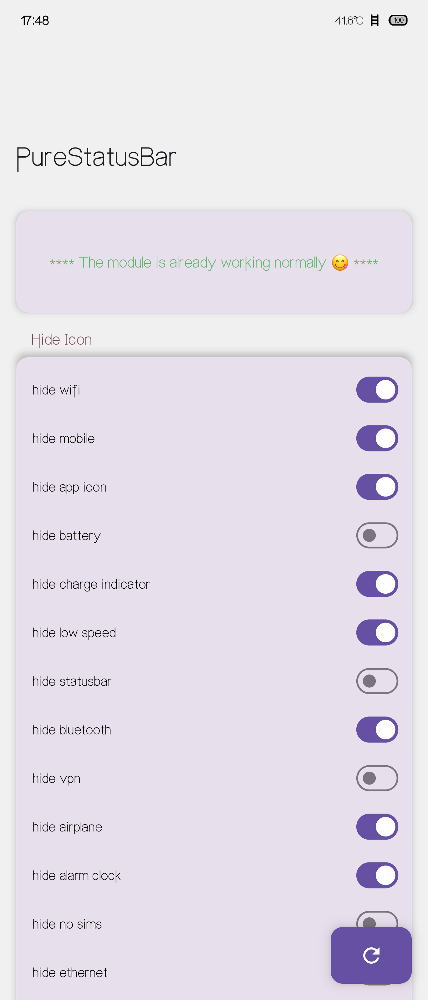

## Flyme状态栏美化模块

自用模块。完美适用于FLYme 11.2.1.0A，附近的版本应该也适用。
功能有 :

+ 隐藏状态栏的任意图标

+ 时间加粗

+ 时间显示秒数

+ 时间显示am/pm(会强制转换为12时计时法)

+ 显示今天是周几

+ 时间显示为时辰

+ 显示CPU温度

+ 显示充放电功率

+ 显示前台app的CPU使用率

+ 双击状态栏锁屏

+ 有其他有趣的想法欢迎提出🥰🥰

### 使用方法

打开你想要的功能的开关，**长按**右下角的按钮(需要给root)

